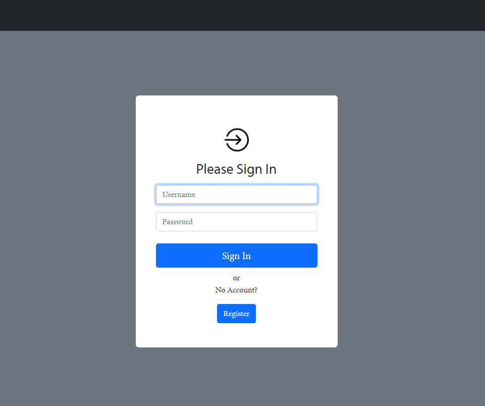
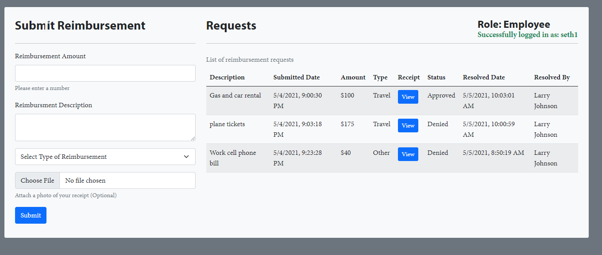
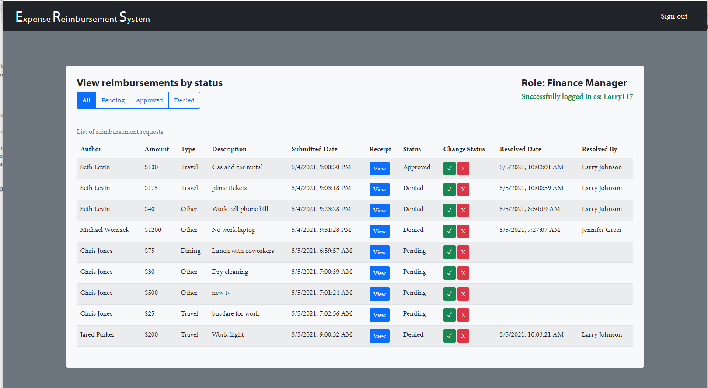

# Expense Reimbursement System (ERS)
ERS is an appliacation that manages the process of reimbursing employees for expenses incurred while on company time. All employees in the company can login and submit requests for reimbursement and view their past tickets and pending requests. Finance managers can log in and view all reimbursement requests and past history for all employees in the company. Finance managers are authorized to approve and deny requests for expense reimbursement.

## Technologies used
#### Backend
- Java
- MariaDB
- Javalin
#### Frontend
- Javascript
- HTML
- CSS and Bootstrap
#### Testting
- JUnit
- Mockito
#### Other
- Hibernate ORM
- Logback

